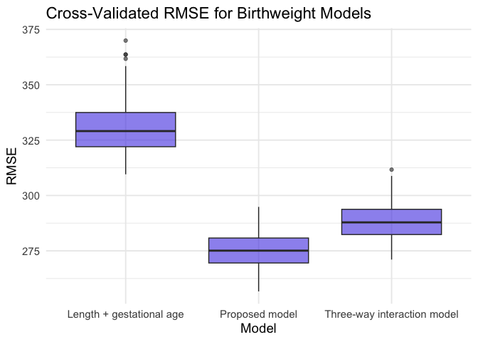

p8105-hw6-yz4994
================
2025-11-30

``` r
library(tidyverse)
```

    ## ── Attaching core tidyverse packages ──────────────────────── tidyverse 2.0.0 ──
    ## ✔ dplyr     1.1.4     ✔ readr     2.1.5
    ## ✔ forcats   1.0.0     ✔ stringr   1.5.1
    ## ✔ ggplot2   3.5.2     ✔ tibble    3.3.0
    ## ✔ lubridate 1.9.4     ✔ tidyr     1.3.1
    ## ✔ purrr     1.1.0     
    ## ── Conflicts ────────────────────────────────────────── tidyverse_conflicts() ──
    ## ✖ dplyr::filter() masks stats::filter()
    ## ✖ dplyr::lag()    masks stats::lag()
    ## ℹ Use the conflicted package (<http://conflicted.r-lib.org/>) to force all conflicts to become errors

``` r
library(broom)
library(janitor)
```

    ## 
    ## Attaching package: 'janitor'
    ## 
    ## The following objects are masked from 'package:stats':
    ## 
    ##     chisq.test, fisher.test

``` r
library(purrr)
library(ggplot2)
library(modelr)
```

    ## 
    ## Attaching package: 'modelr'
    ## 
    ## The following object is masked from 'package:broom':
    ## 
    ##     bootstrap

### Problem 1

``` r
# Load data

homicide_raw = read_csv("homicide-data.csv") |> 
  clean_names()
```

    ## Rows: 52179 Columns: 12
    ## ── Column specification ────────────────────────────────────────────────────────
    ## Delimiter: ","
    ## chr (9): uid, victim_last, victim_first, victim_race, victim_age, victim_sex...
    ## dbl (3): reported_date, lat, lon
    ## 
    ## ℹ Use `spec()` to retrieve the full column specification for this data.
    ## ℹ Specify the column types or set `show_col_types = FALSE` to quiet this message.

``` r
# Clean data

homicide = 
  homicide_raw |> 
  mutate(
    city_state = str_c(city, state, sep = ", "),
    solved = if_else(disposition == "Closed by arrest", 1, 0),
    victim_race = if_else(victim_race %in% c("White", "Black"), victim_race, NA),
    victim_age = as.numeric(victim_age)
  ) |> 
  filter(
    !city_state %in% c("Dallas, TX", "Phoenix, AZ", 
                       "Kansas City, MO", "Tulsa, AL"),
    !is.na(victim_race)
  )
```

    ## Warning: There was 1 warning in `mutate()`.
    ## ℹ In argument: `victim_age = as.numeric(victim_age)`.
    ## Caused by warning:
    ## ! NAs introduced by coercion

``` r
# Baltimore-only

baltimore = 
  homicide |> 
  filter(city_state == "Baltimore, MD")

# Logistic regression

baltimore_fit = 
  glm(
    solved ~ victim_age + victim_sex + victim_race,
    data = baltimore,
    family = binomial()
  )

# Tidy + get ORs

baltimore_tidy = 
  tidy(baltimore_fit, conf.int = TRUE, exponentiate = TRUE)

# Extract adjusted OR: male vs female
male_or = 
  baltimore_tidy |> 
  filter(term == "victim_sexMale") |> 
  select(estimate, conf.low, conf.high)

male_or
```

    ## # A tibble: 1 × 3
    ##   estimate conf.low conf.high
    ##      <dbl>    <dbl>     <dbl>
    ## 1    0.426    0.324     0.558

``` r
# Fit logistic model for each city

city_or_results = 
  homicide |> 
  nest(data = -city_state) |> 
  mutate(
    models = map(
      data,
      ~ glm(
          solved ~ victim_age + victim_sex + victim_race,
          data = .x,
          family = binomial()
        )
    ),
    results = map(models, ~ tidy(.x, conf.int = TRUE, exponentiate = TRUE))
  ) |> 
  select(city_state, results) |> 
  unnest(results) |> 
  filter(term == "victim_sexMale") |> 
  select(
    city_state,
    estimate,
    conf.low,
    conf.high
  ) |> 
  arrange(estimate)
```

    ## Warning: There were 43 warnings in `mutate()`.
    ## The first warning was:
    ## ℹ In argument: `results = map(models, ~tidy(.x, conf.int = TRUE, exponentiate =
    ##   TRUE))`.
    ## Caused by warning:
    ## ! glm.fit: fitted probabilities numerically 0 or 1 occurred
    ## ℹ Run `dplyr::last_dplyr_warnings()` to see the 42 remaining warnings.

``` r
city_or_results
```

    ## # A tibble: 47 × 4
    ##    city_state      estimate conf.low conf.high
    ##    <chr>              <dbl>    <dbl>     <dbl>
    ##  1 New York, NY       0.262    0.133     0.485
    ##  2 Baton Rouge, LA    0.381    0.204     0.684
    ##  3 Omaha, NE          0.382    0.199     0.711
    ##  4 Cincinnati, OH     0.400    0.231     0.667
    ##  5 Chicago, IL        0.410    0.336     0.501
    ##  6 Long Beach, CA     0.410    0.143     1.02 
    ##  7 San Diego, CA      0.413    0.191     0.830
    ##  8 Baltimore, MD      0.426    0.324     0.558
    ##  9 Pittsburgh, PA     0.431    0.263     0.696
    ## 10 Denver, CO         0.479    0.233     0.962
    ## # ℹ 37 more rows

``` r
library(ggplot2)

city_or_results |> 
  mutate(city_state = fct_reorder(city_state, estimate)) |> 
  ggplot(aes(x = city_state, y = estimate)) +
  geom_point(color = "#4F46E5", size = 2) +
  geom_errorbar(aes(ymin = conf.low, ymax = conf.high),
                width = 0.2, color = "#6366F1") +
  geom_hline(yintercept = 1, linetype = "dashed", color = "gray50") +
  coord_flip() +
  labs(
    title = "Adjusted Odds Ratios for Solved Homicides (Male vs Female Victims)",
    x = "City",
    y = "Adjusted OR (Male vs Female)"
  ) +
  theme_minimal(base_size = 14)
```

<!-- -->
The plot shows large variation across cities in the adjusted odds of
solving homicides involving male versus female victims. In most cities,
the estimated ORs are close to 1 and confidence intervals are wide and
include 1, indicating no clear evidence that victim sex affects case
resolution. A few cities show ORs substantially above or below 1, but
these estimates are highly uncertain and likely reflect smaller sample
sizes. Overall, the relationship between victim sex and homicide
resolution appears inconsistent and city-specific, with no strong,
generalizable pattern across the U.S.

### Problem 2

``` r
library(p8105.datasets)
data("weather_df")
```

``` r
set.seed(1)
# Bootstrap

boot_results = 
  tibble(rep = 1:5000) |> 
  mutate(
    sample = map(rep, ~ sample_n(weather_df, size = nrow(weather_df), replace = TRUE)),
    model  = map(sample, ~ lm(tmax ~ tmin + prcp, data = .x)),
    glance = map(model, glance),
    tidy   = map(model, tidy),

    r2 = map_dbl(glance, "r.squared"),

    beta1 = map_dbl(tidy, ~ .x$estimate[.x$term == "tmin"]),
    beta2 = map_dbl(tidy, ~ .x$estimate[.x$term == "prcp"]),
    beta_ratio = beta1 / beta2
  ) |> 
  select(rep, r2, beta_ratio)
```

``` r
boot_results |> 
  ggplot(aes(x = r2)) +
  geom_histogram(bins = 40, fill = "#4F46E5", color = "white") +
  theme_minimal() +
  labs(title = "Bootstrap Distribution of R²")
```

<!-- -->
The bootstrap distribution of r_square is tight, symmetric, and
approximately normal, centered near the observed sample value (around
0.94). This indicates that the model’s explanatory power—how well tmin
and prcp predict tmax—is stable across bootstrap samples. The narrow
spread of the distribution suggests low variability and a high degree of
confidence in the estimated r_square.

``` r
boot_results |> 
  ggplot(aes(x = beta_ratio)) +
  geom_histogram(bins = 40, fill = "#06B6D4", color = "white") +
  theme_minimal() +
  labs(title = "Bootstrap Distribution of β₁ / β₂")
```

<!-- -->
In contrast, the bootstrap distribution of the ratio is much wider, more
variable, and noticeably right-skewed. This behavior arises because the
denominator (the coefficient for prcp) is small and noisy, so small
changes in the fitted model can produce large swings in the ratio,
including extreme negative values. The wide spread and skewness show
that the ratio is a highly unstable statistic, making bootstrap
inference especially valuable since its sampling distribution is far
from normal and cannot be well described analytically.

``` r
ci_r2 = quantile(boot_results$r2, c(0.025, 0.975))
ci_ratio = quantile(boot_results$beta_ratio, c(0.025, 0.975))

ci_r2
```

    ##      2.5%     97.5% 
    ## 0.9343767 0.9466277

``` r
ci_ratio
```

    ##      2.5%     97.5% 
    ## -279.7489 -125.6859

### Problem 3

``` r
birthweight_raw = read_csv("birthweight.csv") |> 
  clean_names()
```

    ## Rows: 4342 Columns: 20
    ## ── Column specification ────────────────────────────────────────────────────────
    ## Delimiter: ","
    ## dbl (20): babysex, bhead, blength, bwt, delwt, fincome, frace, gaweeks, malf...
    ## 
    ## ℹ Use `spec()` to retrieve the full column specification for this data.
    ## ℹ Specify the column types or set `show_col_types = FALSE` to quiet this message.

``` r
# Convert variables to appropriate types
birthweight = 
  birthweight_raw |>
  mutate(
    babysex = factor(babysex, labels = c("male", "female")),
    frace = factor(frace,
                   levels = c(1, 2, 3, 4, 8, 9),
                   labels = c("white", "black", "asian", "puerto_rican", "other", "unknown")),
    mrace = factor(mrace,
                   levels = c(1, 2, 3, 4, 8),
                   labels = c("white", "black", "asian", "puerto_rican", "other")),
    malform = factor(malform, labels = c("absent", "present"))
  )
# Count missing values in each variable
birthweight |> summarise(across(everything(), ~ sum(is.na(.))))
```

    ## # A tibble: 1 × 20
    ##   babysex bhead blength   bwt delwt fincome frace gaweeks malform menarche
    ##     <int> <int>   <int> <int> <int>   <int> <int>   <int>   <int>    <int>
    ## 1       0     0       0     0     0       0     0       0       0        0
    ## # ℹ 10 more variables: mheight <int>, momage <int>, mrace <int>, parity <int>,
    ## #   pnumlbw <int>, pnumsga <int>, ppbmi <int>, ppwt <int>, smoken <int>,
    ## #   wtgain <int>

``` r
model_bw = 
  birthweight |> 
  lm(bwt ~ bhead + blength + gaweeks + babysex + 
       ppbmi + wtgain + smoken + mrace, data = _)

summary(model_bw)
```

    ## 
    ## Call:
    ## lm(formula = bwt ~ bhead + blength + gaweeks + babysex + ppbmi + 
    ##     wtgain + smoken + mrace, data = birthweight)
    ## 
    ## Residuals:
    ##      Min       1Q   Median       3Q      Max 
    ## -1077.87  -186.66    -3.98   178.85  2393.87 
    ## 
    ## Coefficients:
    ##                     Estimate Std. Error t value Pr(>|t|)    
    ## (Intercept)       -5745.6445   101.1071 -56.827  < 2e-16 ***
    ## bhead               132.2457     3.4660  38.155  < 2e-16 ***
    ## blength              76.4225     2.0195  37.843  < 2e-16 ***
    ## gaweeks              11.2176     1.4672   7.645 2.55e-14 ***
    ## babysexfemale        31.5927     8.5059   3.714 0.000206 ***
    ## ppbmi                 7.0808     1.3372   5.295 1.25e-07 ***
    ## wtgain                4.0902     0.3947  10.364  < 2e-16 ***
    ## smoken               -4.6265     0.5887  -7.859 4.85e-15 ***
    ## mraceblack         -147.8576     9.2848 -15.925  < 2e-16 ***
    ## mraceasian          -96.6499    42.5278  -2.273 0.023097 *  
    ## mracepuerto_rican  -138.4455    18.7592  -7.380 1.89e-13 ***
    ## ---
    ## Signif. codes:  0 '***' 0.001 '**' 0.01 '*' 0.05 '.' 0.1 ' ' 1
    ## 
    ## Residual standard error: 274.3 on 4331 degrees of freedom
    ## Multiple R-squared:  0.7137, Adjusted R-squared:  0.7131 
    ## F-statistic:  1080 on 10 and 4331 DF,  p-value: < 2.2e-16

``` r
birthweight_aug = 
  birthweight |> 
  add_predictions(model_bw) |> 
  add_residuals(model_bw)

birthweight_aug |> 
  ggplot(aes(x = pred, y = resid)) +
  geom_point(alpha = 0.3, color = "#4F46E5") +
  geom_hline(yintercept = 0, linetype = "dashed") +
  theme_minimal(base_size = 14) +
  labs(
    title = "Residuals vs Fitted Values for Birthweight Model",
    x = "Fitted Values",
    y = "Residuals"
  )
```

<!-- -->

``` r
model_main = 
  lm(bwt ~ bhead + blength + gaweeks + babysex +
       ppbmi + wtgain + smoken + mrace,
     data = birthweight)
```

``` r
model_len_age = 
  lm(bwt ~ blength + gaweeks, data = birthweight)
```

``` r
model_interactions = 
  lm(bwt ~ bhead * blength * babysex, data = birthweight)
```

``` r
set.seed(123)

cv_df = 
  crossv_mc(birthweight, n = 100, test = 0.2) |> 
  mutate(
    train = map(train, as_tibble),
    test  = map(test, as_tibble)
  )
```

``` r
cv_df =
  cv_df |> 
  mutate(
    fit_main = map(train, ~ lm(bwt ~ bhead + blength + gaweeks + babysex +
                                 ppbmi + wtgain + smoken + mrace, data = .x)),
    
    fit_len_age = map(train, ~ lm(bwt ~ blength + gaweeks, data = .x)),
    
    fit_interactions = map(train, ~ lm(bwt ~ bhead * blength * babysex, data = .x))
  )
#RMSE
cv_results = 
  cv_df |> 
  mutate(
    rmse_main = map2_dbl(fit_main, test,
                         ~ sqrt(mean((.y$bwt - predict(.x, .y))^2))),
    
    rmse_len_age = map2_dbl(fit_len_age, test,
                            ~ sqrt(mean((.y$bwt - predict(.x, .y))^2))),
    
    rmse_interactions = map2_dbl(fit_interactions, test,
                                 ~ sqrt(mean((.y$bwt - predict(.x, .y))^2)))
  )
```

``` r
cv_long =
  cv_results |> 
  select(starts_with("rmse")) |> 
  pivot_longer(
    everything(),
    names_to = "model",
    values_to = "rmse"
  ) |> 
  mutate(model = recode(model,
                        rmse_main = "Proposed model",
                        rmse_len_age = "Length + gestational age",
                        rmse_interactions = "Three-way interaction model"))

cv_long |> 
  ggplot(aes(x = model, y = rmse)) +
  geom_boxplot(fill = "#4F46E5", alpha = 0.6) +
  theme_minimal(base_size = 14) +
  labs(
    title = "Cross-Validated RMSE for Birthweight Models",
    x = "Model",
    y = "RMSE"
  )
```

<!-- --> 1. Length +
gestational age (simple model) This model has the highest RMSE and
substantial variability across folds. This indicates that although
length and gestational age are important predictors, the model is too
simple and fails to capture much of the variation in birthweight.

2.  Proposed model (moderate complexity) The proposed model achieves the
    lowest RMSE and is also the most stable across CV folds. This
    suggests that incorporating biologically relevant predictors (e.g.,
    head circumference, maternal characteristics, smoking) substantially
    improves predictive accuracy without overfitting.

3.  Three-way interaction model (high complexity) This model performs
    worse than the proposed model and shows greater variability in RMSE.
    Although interactions add flexibility, the full three-way
    interaction structure appears too complex, leading to overfitting
    and reduced out-of-sample accuracy.
